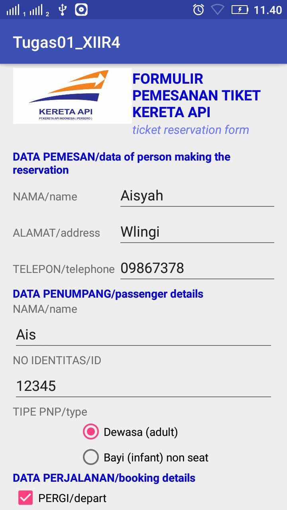
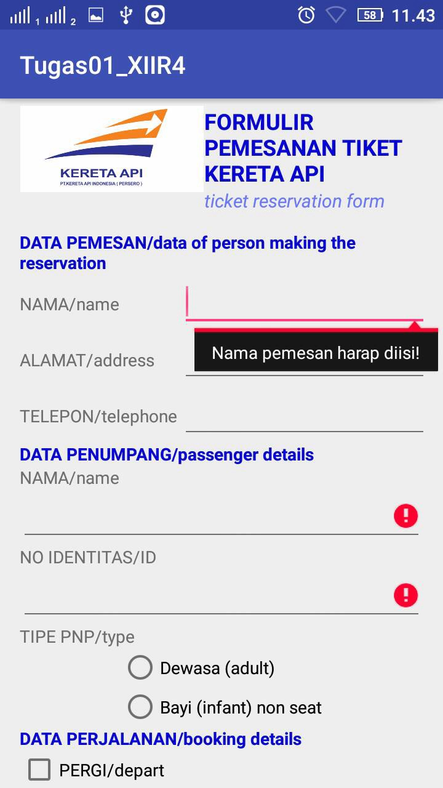
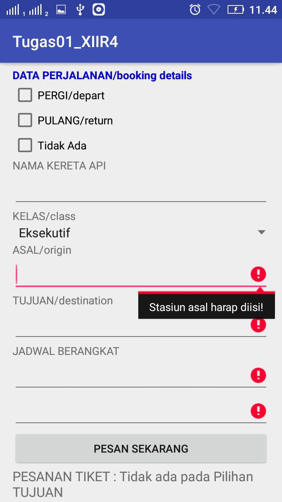
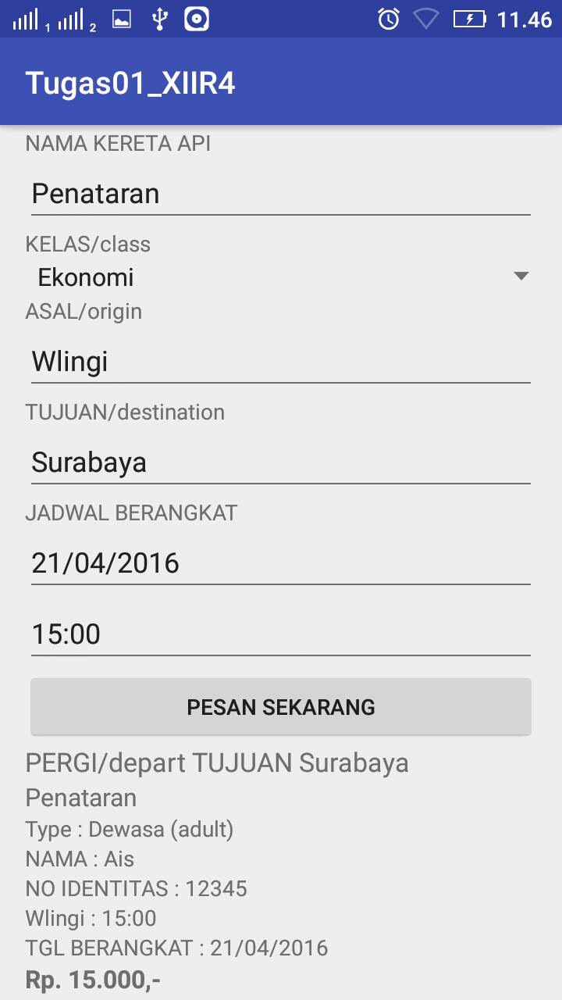

# Tugas01_XIIR4

## Penjelasan Aplikasi 
Form tampilan pemesanan tiket kereta api, mengisikan data diri dan data pemesanan,
mengisi nama, no telp, stasiun awal & tujuan, jadwal keberangkatan, dll, terdapat validasi form yang harus diisi, kegunaannya
untuk mencetak daftar tiket pemesanan

## Screenshot

## Link SDK
https://drive.google.com/open?id=0B7NyfiitjaGick1MNEV1TjllOWs - automatic!
[Tugas01_XIIR4](https://drive.google.com/open?id=0B7NyfiitjaGick1MNEV1TjllOWs)

## Identitas
* Nama      : Aisyah Nanda Kartina
* Kelas     : XII RPL 4
* No.Absen  : 02
* NIS       : 4277/1175.070
* Sekolah   : SMK Telkom Malang
